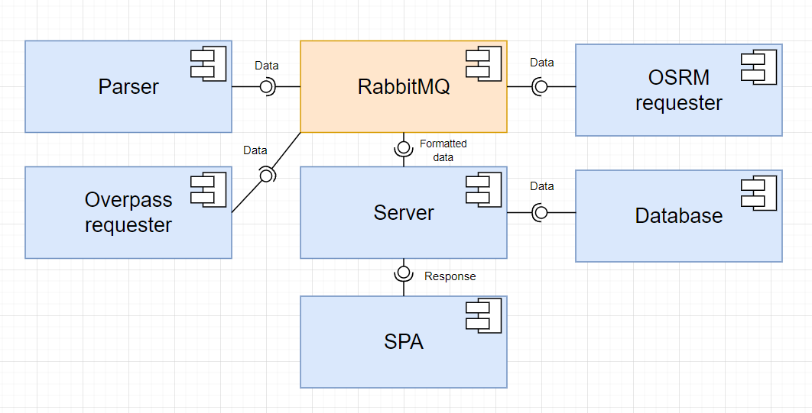

# price-map

Приложение отображающее кластеризированные слои с товарами и магазинами. Для товаров отображается основная информация о них (название, описание, картинка, цена), для магазинов - их название. Товары можно добавить в избранное, в маршрут, посмотреть всю информацию. Для магазинов можно посмотреть простую 3D-модель здания, в котором находится магазин. Есть возможность построить маршрут между точками, где находятся товары, который отобразится на карте. Данные парсятся с маркетплейса [Price ru](https://price.ru/). 

Для реализации была использована микросервисная архитектура. Общая схема приложения представлена ниже:

Более подробная информация по каждой части приложения представлена в файлах **apps/\*/README.md**
